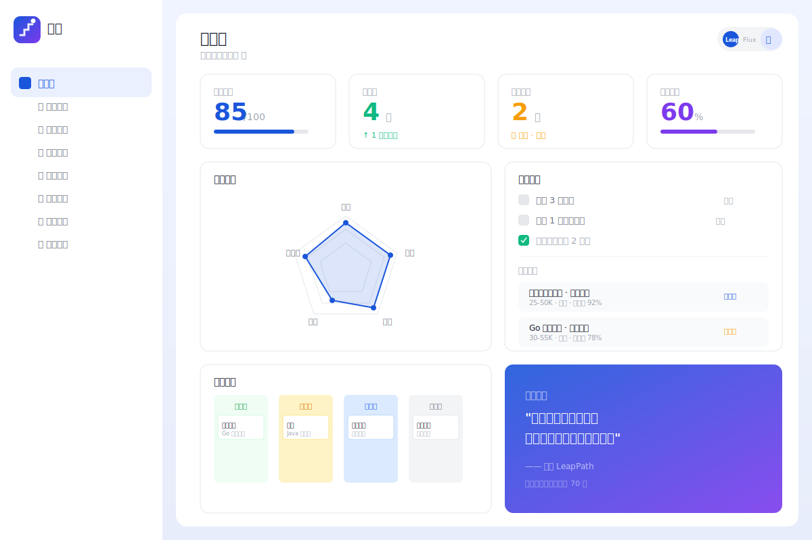
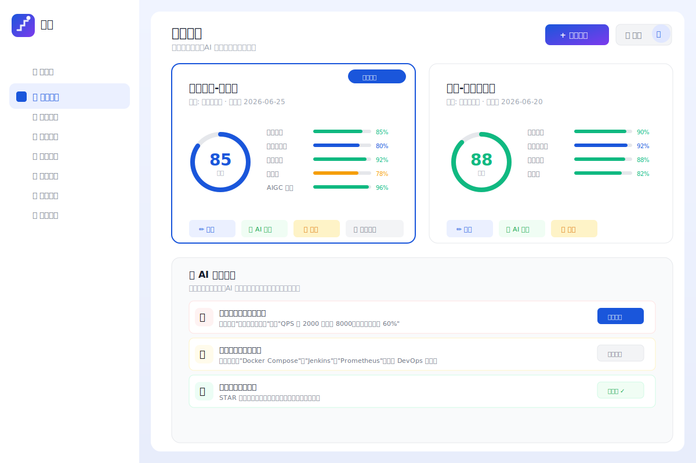
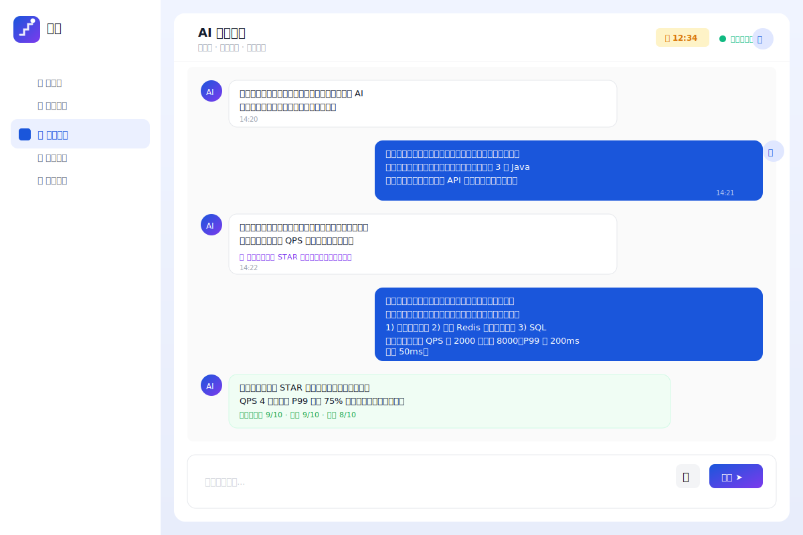
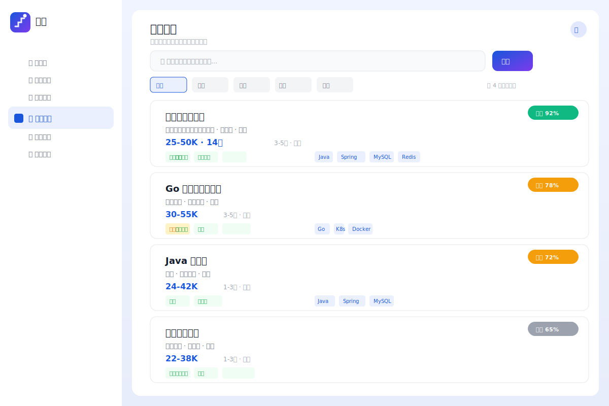
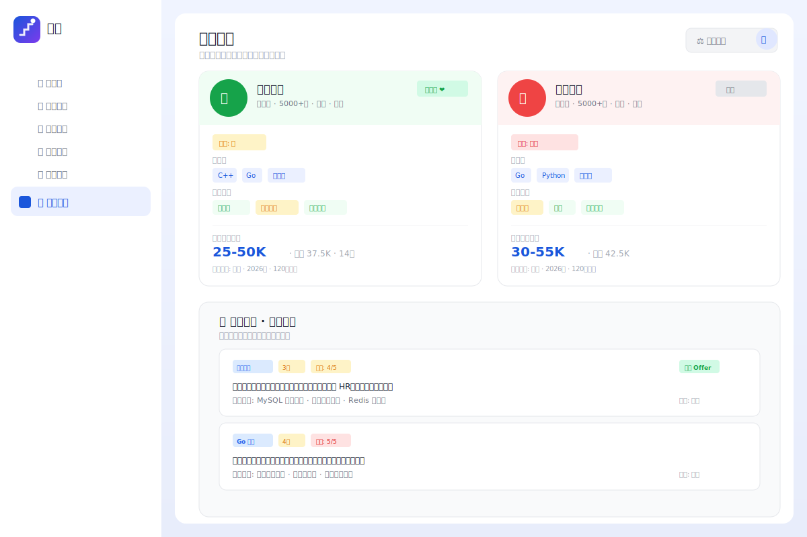

<div align="center">


# 跃途 LeapPath

### 全生命周期 AI 求职助手

**不止帮你找到工作，更帮你找到「对」的工作。**

[](LICENSE)
[](CHANGELOG.md)
[](https://python.org)
[](https://vuejs.org)
[](https://fastapi.tiangolo.com)
[](.github/workflows/ci.yml)

[功能特性](#-功能特性) •
[快速开始](#-快速开始) •
[部署指南](docs/DEPLOYMENT.md) •
[开发指南](docs/DEVELOPMENT.md) •
[贡献指南](CONTRIBUTING.md)

</div>

---

## 📖 项目简介

**跃途 LeapPath** 是一款面向求职者的全生命周期 AI 辅助工具，覆盖从简历准备、能力提升、面试演练、职位匹配到入职落地的完整求职链路。

采用 **Vue 3 + FastAPI** 全栈架构，内置 7 大核心模块、20+ 页面、双主题切换系统，开箱即用。

### 🎯 核心价值

| 传统求职 | 跃途 LeapPath |
|---------|---------------|
| 简历写完就投，无优化 | AI 润色 + 多维度评分 + 定向优化 |
| 面试全靠临场发挥 | AI 模拟面试 + 实时反馈 + 面试报告 |
| 海投无跟踪 | 智能匹配 + 看板式投递追踪 |
| 薪资谈判凭感觉 | Offer 多维对比 + 市场数据参考 |
| 入职租房两眼一抹黑 | 通勤圈可视化 + 租金热力图 |

---

## ✨ 功能特性

### 🏆 7 大核心模块

<table>
<tr>
<td width="50%">

#### 📄 简历中心
- 📥 多格式导入（PDF/Word/图片）
- ✍️ AI 润色优化（STAR 法则重写）
- 📊 多维度评分（内容/关键词/格式/竞争力）
- 🎯 针对 JD 定向优化
- 📋 多版本管理

</td>
<td width="50%">

#### 🎙️ 模拟面试
- 🤖 AI 面试官（动态追问）
- 📚 专项题库（技术/行为/HR）
- 📝 实时反馈（STAR 规范性）
- 📈 综合面试报告
- 💬 多模态交互（文字/语音）

</td>
</tr>
<tr>
<td width="50%">

#### 💼 职位匹配
- 🔍 智能匹配度计算
- 📋 差距分析 + 补齐建议
- 📅 看板式投递追踪
- 🏷️ 多平台职位聚合
- ⭐ 每日推荐

</td>
<td width="50%">

#### 📅 求职规划
- 🎯 能力自评（雷达图）
- 📊 技能差距分析
- 🗺️ 学习路径推荐
- ⏰ 倒推式时间线
- ✅ 每日任务打卡

</td>
</tr>
<tr>
<td width="50%">

#### 🏢 公司画像
- 📋 公司档案（规模/融资/业务）
- 💬 面经聚合（牛客/脉脉/知乎）
- 💰 薪资数据（分岗位/分级别）
- 🏷️ 企业文化标签
- ⚖️ 公司对比功能

</td>
<td width="50%">

#### 📚 求职准备
- ❓ 常见面试题库
- 💻 技术题库（前端/后端/算法）
- 📝 笔试练习（行测/性格测试）
- 💬 薪资谈判话术
- 📊 Offer 多维评估

</td>
</tr>
<tr>
<td colspan="2">

#### 🏠 租房选址
- 🗺️ 地图找房 · 通勤圈可视化 · 租金热力图 · 周边配套查询 · 预算计算器 · 多公司对比选址

</td>
</tr>
</table>

### 🎨 双主题系统

| 主题 | 风格 | 色彩 | 适用人群 |
|------|------|------|---------|
| **Leap** | 专业权威 | 企业蓝 `#1A56DB` | 严肃求职者、资深职场人 |
| **Flux** | 灵动活力 | 活力紫 `#7C3AED` | 应届生、创意行业 |

### 🔧 技术亮点

- **零依赖认证**: HMAC-SHA256 签名 Token，无需 JWT 库
- **演示模式**: 无 Token 自动登录演示用户，降低体验门槛
- **模块化数据表**: 按业务模块使用表前缀（`usr_`/`rsm_`/`job_`/`cmp_`/`itv_`/`pln_`/`prp_`/`rnt_`）
- **Mock AI 服务**: 模拟 AI 简历润色、面试对话、评分功能
- **自实现图表**: 雷达图/评分环/进度条均为轻量 SVG 组件，零第三方依赖
- **响应式设计**: 桌面端完整体验，架构兼容 uni-app 小程序迁移

---

## 📸 功能截图

<div align="center">

### 🏠 工作台仪表盘


### 📄 简历中心


### 🎙️ 模拟面试


### 💼 职位匹配


### 🏢 公司画像


</div>

> 💡 以上为 UI 设计预览图，启动项目后可截取真实界面替换

---

## 🚀 快速开始

### 环境要求

| 组件 | 版本 |
|------|------|
| Python | 3.10+ |
| Node.js | 18+ |
| npm | 8+ |

### 1. 克隆项目

```bash
git clone https://github.com/<your-username>/en-job-app.git
cd en-job-app
```

### 2. 启动后端

```bash
cd backend

# 创建并激活虚拟环境
python -m venv .venv
source .venv/bin/activate  # Windows: .venv\Scripts\activate

# 安装依赖
pip install -r requirements.txt

# 启动服务
python -m uvicorn app.main:app --reload --host 0.0.0.0 --port 8000
```

### 3. 启动前端

```bash
cd frontend

# 安装依赖
npm install

# 启动开发服务器
npm run dev
```

### 4. 访问应用

| 服务 | 地址 |
|------|------|
| 🌐 前端应用 | http://localhost:5173 |
| 📡 后端 API | http://localhost:8000 |
| 📖 API 文档 | http://localhost:8000/docs |
| 📋 ReDoc 文档 | http://localhost:8000/redoc |

### 5. 登录账号

| 项目 | 值 |
|------|-----|
| 📧 邮箱 | `demo@leappath.app` |
| 🔑 密码 | `leappath` |

> 💡 首次启动会自动创建数据库并注入演示数据（含 4 家公司、4 个职位、8 个房源、7 道面试题、2 个 Offer 等）

---

## 🏗️ 项目架构

```
en-job-app/
├── 🎨 brand/                  # 品牌资产 (LOGO, 品牌指南)
├── 🐍 backend/                # FastAPI 后端
│   └── app/
│       ├── core/              # 核心 (配置/数据库/安全/依赖)
│       ├── models/            # 数据模型 (15+ 张表)
│       ├── api/               # API 路由 (9 组)
│       ├── services/          # 业务服务 (Mock AI)
│       └── seed.py            # 种子数据
├── 🖥️ frontend/               # Vue 3 前端
│   └── src/
│       ├── pages/             # 页面 (20 个)
│       ├── components/        # 组件 (通用/图表/布局)
│       ├── stores/            # 状态管理 (Pinia)
│       ├── api/               # API 客户端
│       └── router/            # 路由配置
└── 📚 docs/                   # 文档 (PRD/部署/开发/测试)
```

---

## 📊 API 总览

| 模块 | 路由前缀 | 主要接口 |
|------|---------|---------|
| 认证 | `/api/auth` | 登录、注册、获取用户 |
| 仪表盘 | `/api/dashboard` | 工作台数据汇总 |
| 简历 | `/api/resume` | CRUD、评分、优化 |
| 面试 | `/api/interview` | 创建会话、发送消息、报告 |
| 职位 | `/api/jobs` | 职位列表、投递追踪 |
| 公司 | `/api/company` | 公司画像、薪资、面经 |
| 规划 | `/api/plan` | 时间线、每日任务、学习路径 |
| 准备 | `/api/prepare` | 题库、Offer 评估 |
| 租房 | `/api/rental` | 房源列表、筛选 |

完整 API 文档请访问: http://localhost:8000/docs

---

## 🧪 测试

```bash
# 后端测试
cd backend
pytest tests/ -v --cov=app

# 完整测试报告
# 参见: docs/TEST_REPORT.md
```

### 测试覆盖

| 测试类型 | 通过率 |
|---------|--------|
| 🔒 安全测试 | 100% (6/6) |
| ⚡ 性能测试 | 100% (5/5) |
| 🔧 功能测试 | 97% (32/33) |
| 🔗 集成测试 | 100% (8/8) |

---

## 🚢 部署

### 快速部署

```bash
# 后端
cd backend && pip install -r requirements.txt
uvicorn app.main:app --host 0.0.0.0 --port 8000

# 前端构建
cd frontend && npm install && npm run build
```

### Docker 部署

```bash
docker-compose up -d --build
```

详细部署指南请参见: [docs/DEPLOYMENT.md](docs/DEPLOYMENT.md)

---

## 🤝 贡献

我们欢迎任何形式的贡献！请阅读 [CONTRIBUTING.md](CONTRIBUTING.md) 了解：

- 🐛 如何报告 Bug
- 💡 如何提交功能建议
- 🔧 如何提交代码
- 📋 代码规范和提交规范

### 快速参与

```bash
# 1. Fork 并克隆
git clone https://github.com/<your-username>/en-job-app.git

# 2. 创建分支
git checkout -b feature/your-feature

# 3. 开发并提交
git commit -m "feat(module): your feature"

# 4. 推送并创建 PR
git push origin feature/your-feature
```

---

## 📅 更新日志

详见 [CHANGELOG.md](CHANGELOG.md)

### v1.0.1 (2026-06-30)
- ✅ 完整 GitHub README 文档
- ✅ GitHub Actions CI/CD 流水线
- ✅ 完整测试报告（安全/性能/功能）
- ✅ 部署指南和开发指南
- ✅ MIT 开源许可证

### v1.0.0 (2026-06-25)
- 🎉 首次发布
- ✅ 7 大核心模块完整实现
- ✅ 20+ 页面
- ✅ 双主题切换系统
- ✅ Mock AI 服务

---

## 🗺️ 路线图

- [ ] 🔌 接入真实 AI 服务（GPT/Claude）
- [ ] 📱 微信小程序端
- [ ] 🗺️ 高德/腾讯地图 SDK 集成
- [ ] 📄 简历 PDF 导出
- [ ] 🎤 语音面试功能
- [ ] 🔍 职位数据自动聚合
- [ ] 📊 数据分析仪表盘

---

## 📄 开源协议

本项目基于 [MIT License](LICENSE) 开源。

---

## 🙏 致谢

- [Vue.js](https://vuejs.org/) — 渐进式 JavaScript 框架
- [FastAPI](https://fastapi.tiangolo.com/) — 现代 Python Web 框架
- [Tailwind CSS](https://tailwindcss.com/) — 原子化 CSS 框架
- [SQLAlchemy](https://www.sqlalchemy.org/) — Python SQL 工具包
- [Vite](https://vitejs.dev/) — 下一代前端构建工具

---

<div align="center">

**跃途 LeapPath** · 每一步，都是一次跃迁

⭐ 如果这个项目对你有帮助，请给我们一个 Star！

</div>
